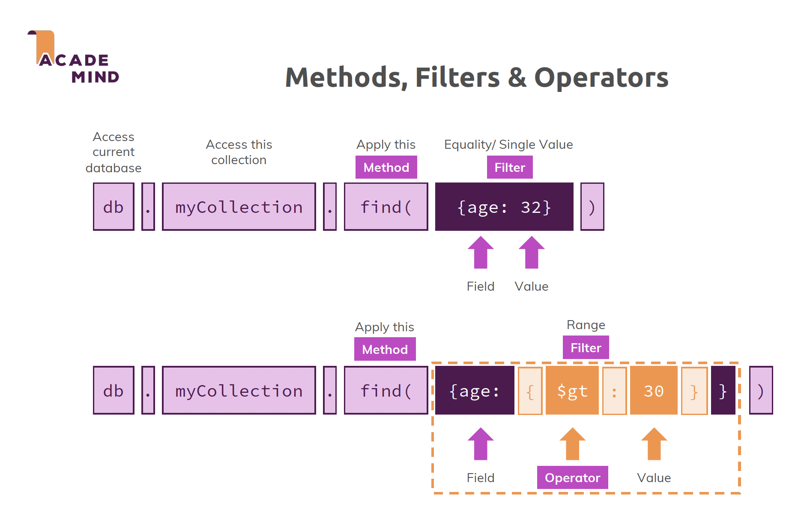

# 07:  Read Operations - A Closer Look
- Course Section: https://www.udemy.com/course/mongodb-the-complete-developers-guide/learn/lecture/11850674#overview
- mongodb-slides.pdf: pg 59-69

Documentation:
- https://www.mongodb.com/docs/manual/tutorial/query-documents/
- https://www.mongodb.com/docs/manual/tutorial/query-arrays/

---

# Query Selectors & Operators

 - You can read documents with find()
and findOne()
 - find() returns a cursor which allows
you to fetch data step-by-step
 - Both find() and findOne() take a filter
(optional) to narrow down the set of
documents they return
 - Filters can use a variety of query
selectors/ operators to control which
documents are retrieved

```javascript
//Connect to the DB
mongosh --port 27017
show dbs
use tv
show collections

// Count all documents in the tvShows collection: 240
db.tvShows.find().count()

//Find one document in the tvShows collection
db.tvShows.findOne({"_id":ObjectId("691ceda03b4b4db5b10b7f68")});

//Find one document by name: The Wire
db.tvShows.findOne({"name":"The Wire"});

//Find with filter: find all TV shows with rating.average > 9.3
db.tvShows.find({ "rating.average": { $gt: 9.3 } });

//Find with filter: find all TV shows with rating.average between 9.0 and 9.3
db.tvShows.find({ "rating.average": { $gte: 9.0, $lte: 9.3 } });

//Find in an array: find all TV shows that belong to the Drama genre (can have other genres as well)
db.tvShows.find({ "genres": "Drama" });

//Find in an array: find all TV shows that only belong to the Drama and Action genres:
db.tvShows.find({ "genres":  [ "Drama", "Action" ] });

//Find in an array: find all TV shows that belong to the Drama and Action genres (can have other genres as well):
db.tvShows.find({ "genres": { $all: [ "Drama", "Action" ] } });

```

---

# Cursors
 - find() returns a cursor to allow you to efficiently retrieve data step by step (instead offetching all the documents in one step)
 - You can use a cursor to move through the documents
 - sort(), skip() and limit() can be used to control the order, portion and quantity of the retrieved results
```javascript

//Use the mongo shell javascript API to work with a cursor
const cursor = db.tvShows.find({ "rating.average": { $gt: 9.0 } });
while (cursor.hasNext()) {
  printjson(cursor.next());
}

//Use a cursor to find all TV shows with rating.average > 9.0, sort by rating.average descending, skip the first 2 results and limit to 5 results
db.tvShows.find({ "rating.average": { $gt: 9.0 } })
  .sort({ "rating.average": -1 })
  .skip(2)
  .limit(5);
```
---

# Projection
 - Projection allows you to control which fields are returned in your result set
 - You can include fields (field: 1) and exclude them(field: 0)
 - For arrays, special projection operators help you return the right field data

```javascript
//Find all TV shows with rating.average > 9.0, only return the name and rating fields (exclude _id field as well)
db.tvShows.find(
  { "rating.average": { $gt: 9.0 } },
  { name: 1, rating: 1, _id: 0 }
);

//Use projection with arrays: find all TV shows with rating.average > 9.0, only return the name and the first genre ($slice: 1) in the genres array
db.tvShows.find(
  { "rating.average": { $gt: 9.0 } },
  { name: 1, genres: { $slice: 1 }, _id: 0 }
);

//Use projection with arrays: find all TV shows with rating.average > 9.0, only return the name and the last genre ($slice: - 1) in the genres array:
db.tvShows.find(
  { "rating.average": { $gt: 9.0 } },
    { name: 1, genres: { $slice: -1 }, _id: 0 }
);
```